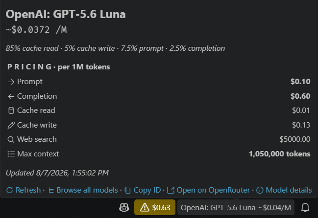
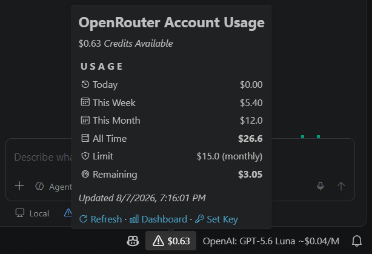
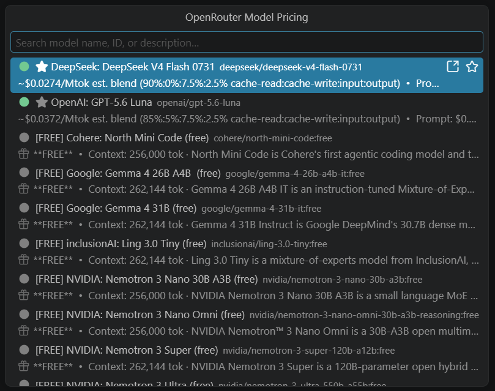
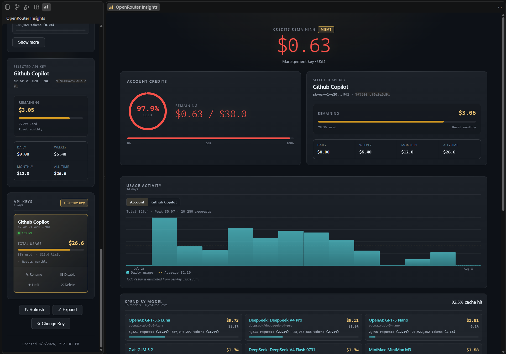

# OpenRouter Insights

See OpenRouter model prices in VS Code. Track your account balance and usage, compare models, and manage OpenRouter API keys in the editor.

Pricing works without an API key. Usage features require an OpenRouter API key.

## Screenshots

<!-- markdownlint-disable MD033 -->

<!-- markdownlint-enable MD033 -->

## Why use OpenRouter Insights?

- See estimated model costs while you work in VS Code.
- Compare OpenRouter models before you choose one.
- See your balance, usage, budgets, and activity in one dashboard.
- Store API keys in VS Code secure storage, not in plain-text files.

## Features

### Model pricing

- **Status bar pricing** — Show the selected model's estimated cost per million tokens. Templates can include the model name, blended rate, prompt price, completion price, context length, and deprecation marker.
- **Automatic model detection** — Read Copilot's active model from its local SQLite state database. A file watcher and polling fallback detect changes.
- **Model browser** — Browse OpenRouter models with sorting, favorites, and free/deprecated filters.
- **Model details and comparison** — Open a detail view for one model or compare two models side by side.
- **Model actions** — Set or clear an override, copy a model ID, open a model on OpenRouter, and inspect or clear the pricing cache.
- **Model picker enhancement** — Show pricing badges and hover details for OpenRouter model IDs.
- **Refresh and cache controls** — Refresh pricing manually or on a schedule. The extension caches pricing locally for a configurable time.
- **Export** — Export pricing data as CSV or JSON.

### Account usage

- **Usage status bar** — Show your account balance with a configurable low-balance warning.
- **Usage dashboard** — Open an activity-bar webview with balance, daily/weekly/monthly/all-time summaries, budget limits, per-key usage, and activity details.
- **Expanded dashboard** — Open the usage dashboard in a full editor tab.
- **Secure key storage** — Store the extension API key through VS Code `SecretStorage`.
- **Background refresh** — Poll account usage automatically or disable background polling for on-demand refresh only.
- **Analytics data** — Include optional analytics data in detailed usage refreshes. Configure the lookback period.
- **Managed API keys** — With a management key, create, rename, enable or disable, limit, and delete managed OpenRouter keys.

## Prerequisites

- **Pricing:** You do not need an API key. Pricing comes from the [OpenRouter public models API](https://openrouter.ai/api/v1/models). To show pricing for the active Copilot model, select an OpenRouter model configured through Copilot BYOK, or Bring Your Own Key. Set `openrouterInsights.general.providerScope` to `allProviders` to show pricing for other providers connected through Copilot.
- **Basic usage:** You need an OpenRouter API key. Create one at [openrouter.ai/keys](https://openrouter.ai/keys). A regular key provides usage data for that key.
- **Account-wide usage:** A management key provides account-wide usage and managed-key operations. Use a management key only for these features.

> **Note:** You do not need a management key. Use one to access all extension features.

## Installation

1. Install [OpenRouter Insights from the VS Code Marketplace](https://marketplace.visualstudio.com/items?itemName=RLAlpha49.openrouter-insights).
2. Reload VS Code if prompted.
3. Select an OpenRouter model in Copilot or run **Browse Model Pricing** to see prices.
4. Run **OpenRouter Insights: Set Extension API Key (OpenRouter)** and enter a regular key to see usage.
5. Open the **OpenRouter Insights** view from the Activity Bar to see your usage dashboard.

## Privacy and security

- The extension stores API keys in VS Code `SecretStorage`. It does not write keys to plain-text files.
- The extension sends pricing and authenticated usage requests directly to OpenRouter.
- The extension does not proxy inference traffic.
- Logs and errors redact bearer tokens, API keys, and `sk-or-v1-...` values.
- Usage details stay in memory for the current extension session. The extension exports them only when you request an export.
- The extension does not send telemetry to third parties.

See [Detailed privacy and security](#detailed-privacy-and-security) for network, caching, polling, and retention details.

## Troubleshooting

- **No model appears in the status bar:** Select an OpenRouter model or set `openrouterInsights.general.selectedModelId`.
- **Pricing is missing:** Run **Refresh OpenRouter Pricing**. Then verify the model at [openrouter.ai/models](https://openrouter.ai/models).
- **Usage data is unavailable:** Set an extension API key. Use a management key for account-wide data. Check the usage feature toggle.
- **The status bar does not update after a model switch:** Wait for the poll interval or run **Refresh OpenRouter Pricing**.
- **The extension does not activate:** Update VS Code if it is older than 1.90.

## Support

- [Report a bug](https://github.com/RLAlpha49/openrouter-insights/issues)
- [Request a feature](https://github.com/RLAlpha49/openrouter-insights/issues/new)
- [Read the changelog](CHANGELOG.md)
- [Contribute to the project](CONTRIBUTING.md)

## Commands

### Pricing and model commands

| Command                                          | Description                                    |
| ------------------------------------------------ | ---------------------------------------------- |
| **Refresh OpenRouter Pricing**                   | Fetch the latest public pricing data.          |
| **Browse Model Pricing**                         | Open the model browser.                        |
| **Compare Models**                               | Select two models for side-by-side comparison. |
| **Set Model Override**                           | Manually choose the model to track.            |
| **Clear Selected Model Override**                | Return to automatic model detection.           |
| **Add to Favorites** / **Remove from Favorites** | Pin or unpin a model in the browser.           |
| **Copy Model ID**                                | Copy the selected model ID.                    |
| **Open on OpenRouter**                           | Open the selected model's OpenRouter page.     |
| **View Model Detail**                            | Open the selected model's detail view.         |
| **Clear Pricing Cache** / **Show Cache Info**    | Manage or inspect the local pricing cache.     |

### Status and export commands

| Command                       | Description                             |
| ----------------------------- | --------------------------------------- |
| **Toggle Status Bar Display** | Show or hide pricing in the status bar. |
| **Show Logs**                 | Open the extension output channel.      |
| **Quick Actions**             | Open the command quick-actions menu.    |
| **Export Pricing as CSV**     | Save the pricing dataset as CSV.        |
| **Export Pricing as JSON**    | Save the pricing dataset as JSON.       |

### Usage and account commands

| Command                                | Description                                               |
| -------------------------------------- | --------------------------------------------------------- |
| **Set Extension API Key (OpenRouter)** | Store the extension's OpenRouter API key.                 |
| **Remove Extension API Key**           | Remove the stored extension key.                          |
| **Refresh Usage Data**                 | Fetch the latest account usage data.                      |
| **Load Usage Details**                 | Fetch activity details and optional analytics enrichment. |
| **Select API Key for Usage View**      | Select the key shown in the dashboard.                    |
| **Open Usage Dashboard**               | Open the activity-bar dashboard.                          |
| **Open Expanded Usage Dashboard**      | Open the dashboard in an editor tab.                      |
| **Create API Key**                     | Create a managed OpenRouter API key.                      |
| **Rename API Key**                     | Rename a managed key.                                     |
| **Enable/Disable API Key**             | Change a managed key's active state.                      |
| **Set API Key Credit Limit**           | Set a managed key's spending limit.                       |
| **Delete API Key**                     | Delete a managed key.                                     |

## Configuration

All settings use the `openrouterInsights` prefix.

### Status bar

- `openrouterInsights.statusBar.show` (`boolean`, default `true`) — Show pricing in the VS Code status bar.
- `openrouterInsights.statusBar.maxWidth` (`number`, default `0`) — Set the maximum number of model-name characters. `0` lets VS Code handle overflow.
- `openrouterInsights.statusBar.clickAction` (`string`, default `browseModels`) — Choose `browseModels`, `refreshPricing`, `showLogs`, or `quickActions`.
- `openrouterInsights.statusBar.template` (`string`, default `${deprecation}${modelName} ${priceText}${deprecation}`) — Use `${modelName}`, `${priceText}`, `${blendedRate}`, `${promptPrice}`, `${completionPrice}`, `${contextLength}`, and `${deprecation}`.

### Model browser

- `openrouterInsights.modelBrowser.showFreeOnly` (`boolean`, default `false`) — Show only free models.
- `openrouterInsights.modelBrowser.sort` (`string`, default `blendedRate`) — Sort by `blendedRate`, `promptPrice`, `completionPrice`, `contextLength`, or `name`.
- `openrouterInsights.modelBrowser.favorites` (`array`, default `[]`) — Pin these model IDs to the top of the browser.
- `openrouterInsights.modelBrowser.showDeprecated` (`boolean`, default `true`) — Include deprecated or legacy models.

### General pricing and refresh

- `openrouterInsights.general.selectedModelId` (`string`, default empty) — Override automatic model detection.
- `openrouterInsights.general.providerScope` (`string`, default `openrouterOnly`) — Choose `openrouterOnly` or `allProviders`.
- `openrouterInsights.general.logLevel` (`string`, default `info`) — Choose `debug`, `info`, `warn`, or `error`.
- `openrouterInsights.general.apiBaseUrl` (`string`, default `https://openrouter.ai/api/v1/models`) — Set the base URL for the public models request. Authenticated usage requests use the fixed OpenRouter origin.
- `openrouterInsights.general.autoRefreshInterval` (`number`, default `3600`) — Set the pricing refresh interval in seconds. The supported range is 300–86400. `0` disables scheduled refresh.
- `openrouterInsights.general.modelPollInterval` (`number`, default `30`) — Set the model-change polling interval in seconds. `0` uses the file watcher only.
- `openrouterInsights.general.blendWeights` (`object`, default `prompt: 10`, `completion: 5`, `cacheRead: 80`, `cacheWrite: 5`) — Set weights that total 100%.
- `openrouterInsights.general.cacheTtlHours` (`number`, default `24`) — Set the pricing cache time in hours. The supported range is 1–720.

### Feature toggles

Each feature is enabled by default:

- `openrouterInsights.features.statusBar.enabled` — Pricing status bar.
- `openrouterInsights.features.modelBrowser.enabled` — Model browser and switcher commands.
- `openrouterInsights.features.comparison.enabled` — Model comparison view.
- `openrouterInsights.features.export.enabled` — CSV and JSON exports.
- `openrouterInsights.features.favorites.enabled` — Model favorites.
- `openrouterInsights.features.hoverProvider.enabled` — Pricing hovers for OpenRouter model IDs.
- `openrouterInsights.features.usage.enabled` — Account usage tracking.

### Usage

- `openrouterInsights.usage.autoRefreshInterval` (`number`, default `300`) — Set the usage refresh interval in seconds. `0` disables it.
- `openrouterInsights.usage.backgroundPolling.enabled` (`boolean`, default `true`) — Allow background authenticated usage polling.
- `openrouterInsights.usage.analytics.enabled` (`boolean`, default `true`) — Include analytics in detailed refreshes.
- `openrouterInsights.usage.analytics.lookbackDays` (`number`, default `30`) — Set the analytics lookback from 1 to 90 days.
- `openrouterInsights.usage.lowBalanceThreshold` (`number`, default `10`) — Set the dollar threshold for a status-bar warning. `0` disables warnings.
- `openrouterInsights.usage.showStatusBar` (`boolean`, default `true`) — Show the account balance in the status bar.
- `openrouterInsights.usage.statusBarClickAction` (`string`, default `fullDashboard`) — Choose `fullDashboard`, `sidebarDashboard`, or `quickActions`.
- `openrouterInsights.usage.showDashboard` (`boolean`, default `true`) — Show the usage dashboard in the sidebar.

### Currency

- `openrouterInsights.general.currency` (`string`, default `USD`) — Choose `USD`, `EUR`, `GBP`, `JPY`, `KRW`, `CNY`, `INR`, `CAD`, `AUD`, or `BRL`.
- `openrouterInsights.general.currencyRate` (`number`, default `0`) — Set a custom USD-to-target rate. `0` uses the built-in static rate.

## Blended rate formula

The blended estimate shows an approximate cost per million tokens:

- Models with cache pricing use the configured cache-read, prompt, completion, and cache-write weights. The defaults are 80%, 10%, 5%, and 5%.
- Models without cache pricing use the prompt and completion weights normalized over those two values. The defaults are 66.7% and 33.3%.

> Actual cost varies with cache-hit rate, conversation length, and model behavior. Treat the blended rate as an estimate.

## Detailed privacy and security

The privacy summary above covers key storage, network requests, redaction, and telemetry.

- **Local data** — The extension caches pricing in VS Code `globalState`. It keeps usage data in memory and refreshes it through manual or configured polling. It creates exports only when you request them.
- **Analytics and polling** — Settings control background usage polling and analytics data.
- **Usage scope** — The extension can request account credits, single-key usage, managed-key lists, activity history, per-key activity, and analytics data.

Detailed activity and analytics load through **Load Usage Details** and remain in memory for the current extension session.

## Develop locally

1. Run `npm install`.
2. Run `npm run bundle` or press **F5** to use the extension launch configuration.
3. Test the extension in the Extension Development Host window.

Run `npm run build` for a production build. Run `npm test` for tests. Run `npm run size` for the bundle and VSIX size report. See [CONTRIBUTING.md](CONTRIBUTING.md) for the development and release workflow.

## License

[MIT](LICENSE.md)
