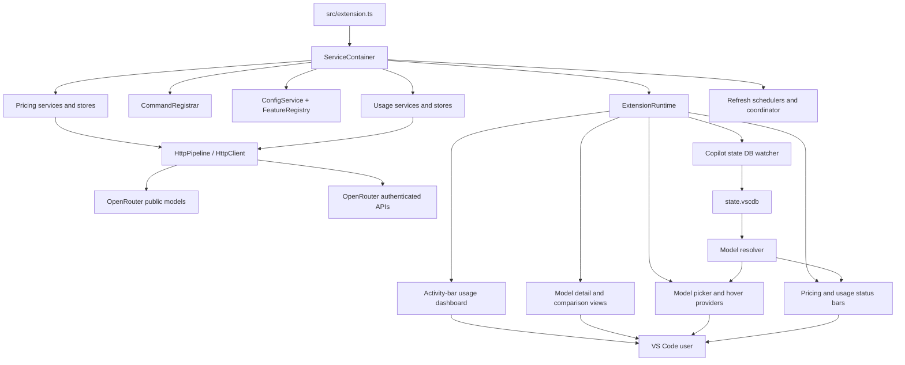

# OpenRouter Insights — Architecture

## Overview

OpenRouter Insights is a VS Code extension that combines two workflows:

1. It resolves the active Copilot model, loads public OpenRouter pricing, and presents an estimated cost in the status bar and model-selection surfaces.
2. It optionally authenticates to OpenRouter to display account credits, usage, budgets, activity, analytics, and managed API-key data.

`src/extension.ts` is the activation entry point. The service composition in `src/infrastructure/services.ts` creates the runtime dependencies, and `ExtensionRuntime` owns activation-scoped registrations and disposal.

## Component diagram



The usage dashboard is contributed as the `openrouter-insights.usageDashboard` webview in the `openrouter-insights-usage` activity-bar container. The expanded dashboard opens the same experience in an editor tab.

## Module boundaries

- `src/api/` integrates with OpenRouter, decodes external responses, applies endpoint policies, stores pricing and usage data, and handles secret storage. Transport, endpoint, client, and cache modules are grouped under `src/api/transport/`, `src/api/endpoint/`, `src/api/clients/`, and `src/api/cache/`.
- `src/infrastructure/` composes services, validates configuration, registers commands, manages feature flags, schedules refreshes, watches Copilot state, and owns lifecycle coordination.
- `src/models/` contains pricing/domain calculations and the zero-dependency SQLite reader used for Copilot model discovery.
- `src/ui/` renders status bars, QuickPick/model surfaces, detail and comparison webviews, exports, formatting, currency conversion, and the usage dashboard. Status, model-browser, webview, and formatting modules are grouped under `src/ui/status/`, `src/ui/model-browser/`, `src/ui/webviews/`, and `src/ui/formatting/`.
- `src/use-cases/` coordinates refresh and presentation workflows without making UI components responsible for API calls.
- `src/__tests__/` mirrors the source areas and tests API contracts, lifecycle behavior, model parsing, use cases, and UI transformations.

## Activation and lifecycle

1. VS Code activates the extension on startup.
2. `extension.ts` creates the service container and starts `ExtensionRuntime`.
3. Runtime registration installs commands, status bars, the activity-bar usage webview, model hover behavior, the Copilot state watcher, configuration observers, and polling services.
4. Configuration changes update validated settings and feature state. Relevant schedulers and views react through the event bus and typed configuration events.
5. Deactivation disposes the runtime-owned timers, watchers, webviews, commands, subscriptions, status bars, and API resources.

All resources are activation-scoped. Runtime disposal is the boundary that prevents timers, file watchers, webview messages, and in-flight UI updates from outliving the extension host.

## Pricing data flow

1. `ModelResolver` reads Copilot's active model from `state.vscdb` through `stateDbReader.ts`, with validation and fallback to the configured selected model.
2. `RefreshUseCase` requests the public models catalog through `PricingService` and the shared logging `HttpPipeline`.
3. Contract decoders retain valid model entries and record bounded contract-health information for malformed collection entries.
4. Domain parsing converts per-token prices to per-million-token values, derives display names, applies deprecation heuristics, and calculates the configurable blended rate.
5. `PricingCache` persists pricing in VS Code `globalState` using a staging-key write and a final swap. Cache TTL and invalidation are controlled by configuration and cache commands.
6. `StatusBarUpdateUseCase` resolves the selected model, matches it by ID or derived name, renders the configured status-bar template, and updates the pricing status bar.
7. `ModelPickerEnhancer`, `ModelHoverProvider`, `ModelDetailView`, `ComparisonViewService`, and export services consume the same pricing store rather than issuing their own model-catalog requests.

The model watcher and `general.modelPollInterval` keep model-dependent UI current. `general.autoRefreshInterval` schedules pricing catalog refreshes; manual refresh and cache commands provide explicit control.

## Usage and account data flow

1. `SecretStorageService` supplies the extension's stored OpenRouter API key.
2. `UsageRefreshUseCase` calls `UsageService` for single-key or management-key data. Management keys can load account credits, all managed keys, per-key limits, and activity.
3. Usage summaries, daily activity, budget limits, and optional analytics are normalized into the usage store.
4. `UsageStatusBarView` presents the account balance and low-balance state. `UsageDashboard` renders the activity-bar webview and responds to dashboard messages.
5. `Load Usage Details` explicitly requests deeper activity and analytics data. Analytics enrichment is controlled by `usage.analytics.enabled` and `usage.analytics.lookbackDays`.
6. Managed-key commands call the key-management endpoints to create, rename, enable or disable, limit, and delete keys. Management permissions are enforced by OpenRouter and translated into user-facing errors.

Usage polling is controlled independently from pricing polling by `usage.backgroundPolling.enabled` and `usage.autoRefreshInterval`. Usage data is held in memory rather than persisted as a long-lived local database.

## HTTP, errors, and security

`HttpPipeline` is composed once and provides shared request/response logging. Endpoint services retain endpoint-specific authentication, timeout, retry, response validation, and normalization because pricing and authenticated usage have different contracts.

`OpenRouterHttpError` classifies authentication, permission, insufficient-credit, not-found, rate-limit, server, malformed-response, transport, and client failures. Retry decisions are class-based: rate-limit and server/transport failures can retry with bounded backoff and server retry hints; authentication, permission, credit, not-found, and malformed-response failures do not retry.

API keys are stored through VS Code `SecretStorage`. `redaction.ts` removes bearer tokens and OpenRouter key-shaped values before logs and user-facing error text are written. Authenticated requests use the fixed OpenRouter API origin; the configurable `general.apiBaseUrl` applies only to the public pricing/models request. The extension does not proxy inference traffic.

## Refresh coordination and cancellation

`RefreshCoordinator` and `RefreshContext` provide generation IDs, abort signals, refresh reasons, deadlines, supersession, and late-result protection for workflows that opt into the coordinator. Concurrent use-case calls may also coalesce through an in-flight promise so a manual refresh and a scheduled refresh do not duplicate work.

Scheduled usage polling enters the coordinator with reason `scheduled`, and `UsagePollingService` coalesces overlapping timer ticks before invoking the refresh callback. Disposal clears the timer and prevents queued work from starting. `UsageRefreshUseCase` receives the same context used by the coordinator and suppresses cache/UI publication after cancellation, so manual, scheduled, and configuration-triggered baseline refreshes share one stale-result boundary. Detail loading retains request-intent coalescing and aborts a superseded detail context.

## Storage and resilience decisions

### Zero-dependency SQLite reader

The model reader implements the minimal SQLite format subset required to inspect Copilot's state database. It reads a stable snapshot, handles page headers, B-tree records, varints, overflow pages, and bounded WAL work, and validates model-shaped identifiers before publishing state. A WAL merge that reaches its frame bound returns `wal-incomplete` without a value, so a potentially stale snapshot cannot be published as a successful model read. `StateDbReader` owns its result cache and diagnostic state, includes WAL metadata in its cache signature, and preserves typed conditions such as `busy`, `unreadable`, and `corrupt` through resolution.

### Pricing cache

Pricing cache writes stage data under a temporary key, verify the staged value, and then replace the active key. This avoids exposing a partially written pricing document after an extension-host interruption.

### Promise coalescing

Use cases with manual and scheduled entry points share an in-flight promise when the operation is already running. The promise is cleared in a `finally` block so later refreshes can run after completion or failure.

### Blend rate

The default cached-pricing estimate is:

```text
blended = prompt × 0.10 + completion × 0.05 + cacheRead × 0.80 + cacheWrite × 0.05
```

Models without cache pricing use the no-cache blend from `src/models/domain.ts`. `general.blendWeights` validates and replaces the configured weights when all four values total 100%.

### Configuration validation

`ConfigService` validates values at the configuration boundary. It applies safe fallbacks for invalid enums and numeric ranges, validates URLs, filters favorites to strings, and logs warnings without allowing malformed settings to leak into API or UI code.

## Extension development seams

A new command has three runtime steps:

1. Add its contribution to `package.json`.
2. Implement `ICommand` in the pricing/model or usage command module, including an argument adapter and optional `quickAction` metadata.
3. Add the instance to the command composition in `services.ts` so `CommandRegistrar` can register it.

New settings must be added to the manifest, exposed through `ReadonlyConfig` and `ConfigService`, and consumed through validated configuration. Feature toggles belong in `FeatureRegistry` and must gate both commands and non-command behavior where appropriate.
